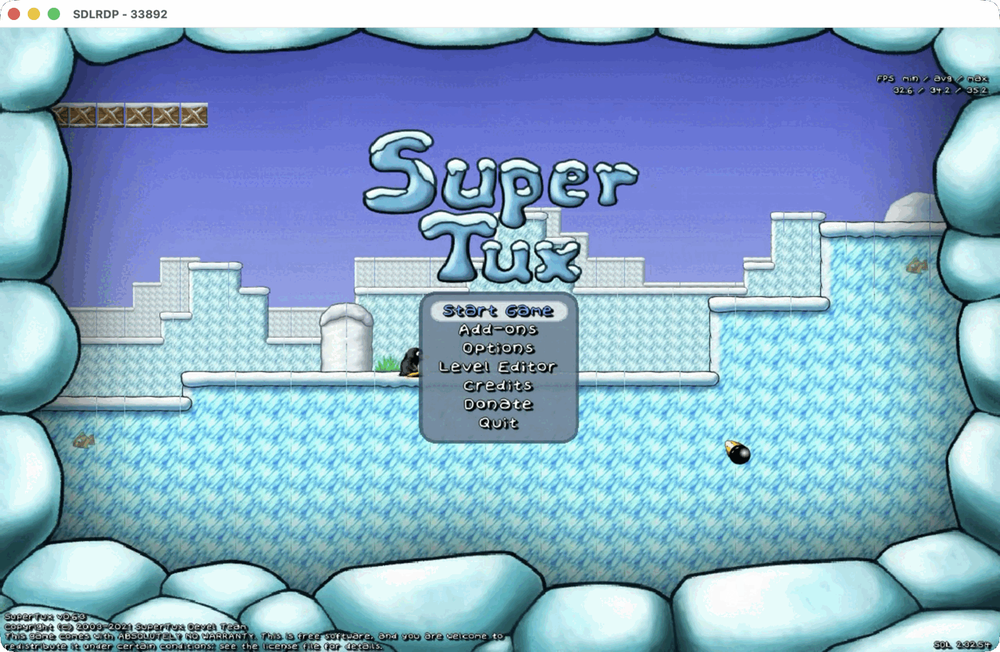
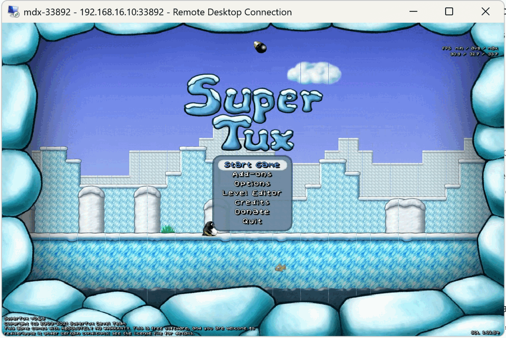
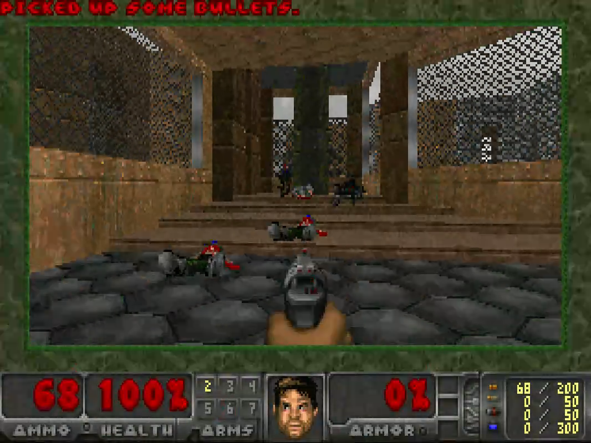
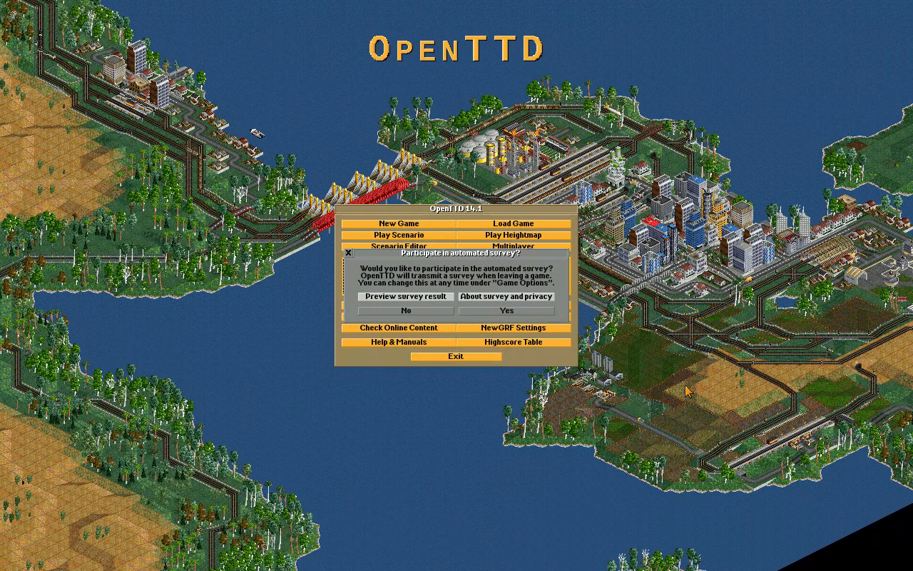
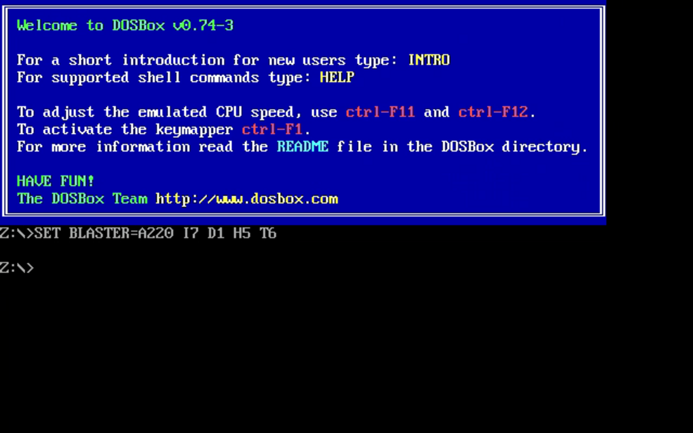

# sdl-rdp

SDL3 with opt-in `rdp` video and playback audio drivers. An unmodified SDL program on a
headless machine, started with `SDL_VIDEO_DRIVER=rdp`, has its window served
over RDP: a Windows or Mac RDP client is its display, keyboard and mouse.

SDL2 programs work through sdl2-compat; playback audio, clipboard text and
shared drives are available with clients such as mstsc, Windows App on Mac
and xfreerdp. Opt-in selection means probing never picks the driver and no
listener opens unasked. The driver and the RDP backend are static modules
compiled into one `libSDL3.so`: the driver composes the backend's classes
directly and includes no FreeRDP header itself. Nothing constructs a
session, listener or FreeRDP object until the `rdp` driver is selected.

## Screenshots

SuperTux 0.6.3, an unmodified SDL2 game through sdl2-compat on top of this SDL3,
served from a headless Linux box and played in Microsoft Remote Desktop.





Chocolate Doom with Freedoom, OpenTTD and DOSBox 0.74-3, SDL2 programs through
sdl2-compat, captured on the box with xfreerdp at 1280x800.







## Quick start

```sh
SDL_VIDEO_DRIVER=rdp SDL_AUDIO_DRIVER=rdp SDL_RDP_USER=me SDL_RDP_PASSWORD=secret ./program
mstsc /v:host:3389
```

The default port is 3389; set `SDL_RDP_PORT` to change it.
Driver settings can live in a settings file named after the library, `libSDL3.yaml`
beside `libSDL3.so`, in YAML or any other format oxbox serialization reads, or in the
one file `SDL_RDP_SETTINGS` names; see [Configuration](docs/configuration.md).
`SDL_VIDEO_DRIVER` and `SDL_AUDIO_DRIVER` are read by SDL core and must be set
through hints or the environment:

```yaml
port: 33892
cert_dir: /home/me/.local/share/sdl-rdp
codec: planar
aspect: 4:3
```

## Documentation

- [Shape](docs/shape.md): project layout and modules.
- [Configuration](docs/configuration.md): driver selection, settings and display modes.
- [Graphics pipeline](docs/graphics.md): codecs, encoding and frame pacing.
- [Authentication](docs/authentication.md): credentials, security modes and callbacks.
- [Clipboard](docs/clipboard.md): text redirection and clipboard APIs.
- [Audio](docs/audio.md): playback, latency and audio-only applications.
- [Building and consuming](docs/building.md): dependencies, builds and packaging.
- [Input](docs/input.md): keyboard scancodes, text input and keymaps; mouse motion, relative mode, wheels and touch.
- [Drives](docs/drives.md): shared storage and file operations.

## Building

Linux builds and tests the tree; each release also carries Windows x86_64 and macOS arm64 archives, cross-built on
Linux. Run `./buildutil build` to build everything.
Run `./buildutil test` for the gate; see [building and consuming](docs/building.md) for dependencies and packaging.

## License

[zlib License](LICENSE).
